# Filuta Assignment
This repository presents a possible solution to a simple car recommender system
design. The solution primarily focuses on back-end software/infrastructure engineering
aspects of the problem. Front-end layer is completely omitted and data science
solution is rather naive (with a lot of assumptions pulled out of thin air).
But it was necessary to pick some data science solution as it dictates some parts
of the presented back-end tech stack (like a database and event handling...).

The solution presented here consists of:

* [Naive recommender design](#naive-recommender)
* [Architecture](#architecture)
* [Prototype](#prototype)

# Naive recommender
As mentioned in the introduction, in my opinion, some data science solution had
to be picked to be able to design the back-end stack.

After a quick research, I essentially ruled out using any complex ML solutions
(since I don't have experience nor intuition in this domain and thus it would be too
time consuming) and narrowed it down to two possible solution (ideally a hybrid of both)
and ordered them based on complexity:

1) Content-based filtering
2) Collaborative filtering

Both solutions seems to boil down to computing some "preference" vector for the user
(either based on some real feature set, in case of content-based filtering,
or latent feature set, in case of collaborative filtering) and representing
each car listing by a feature vector (again either based on real features
or latent ones). Then the recommendations for the user are obtained by finding
nearest car listing neighbours to the users "preference" vectors.

So a high level solution could look something like this
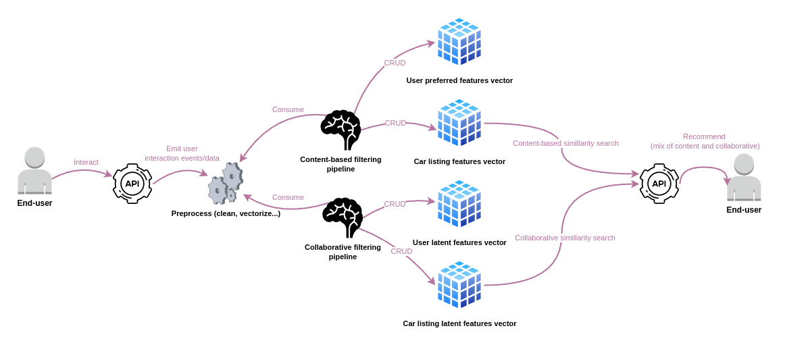

# Architecture
This chapter presents possible software stack and interactions between various stack
components. This is by no means THE RIGHT SOLUTION, this is just A SOLUTION.

A possible product layer (i.e., components implementing recommender business logic)
could look something like this. It is good to emphasize that this solution is based
on many assumptions - for instance Apache Kafka could be more suitable in some cases
or this could possibly be implemented without messaging...
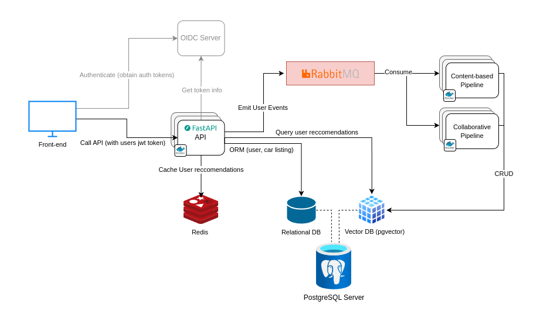

A possible monitoring/observability solution could be based on Prometheus, Grafana and
Grafana Loki, plus some custom made monitoring microservices that construct and
expose some advanced matrics (that can then be collected by Prometheus and
displayed on a Grafana dashboard). A production solution would probably also
include some tracing solution like Sentry.
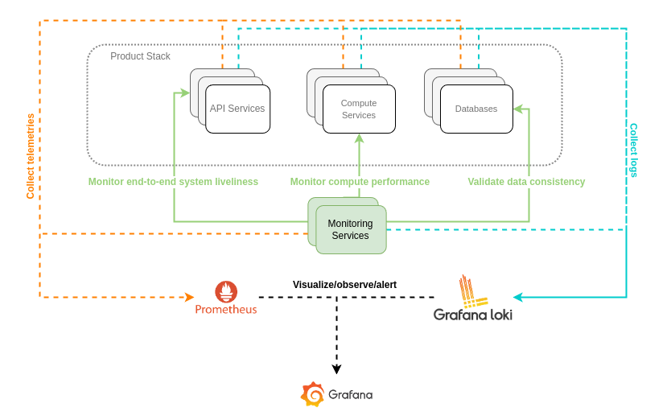

The diagram bellow presents/hints at some way how this stack could be deployed
in a cloud-agnostic way. There are millions of ways how the
infrastructure/deployment model could be created, all depends on various
external and internal constraints.
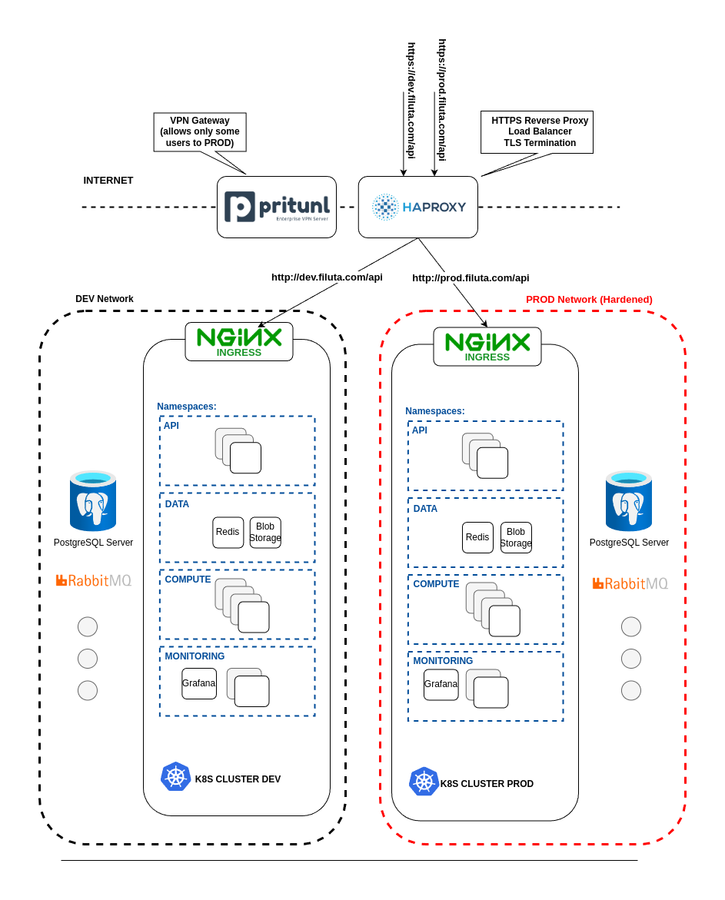

Possible CI/CD flow: #TODO

# Prototype
The idea behind prototype was to implement a reasonable subset of the product
stack presented in the [architecture](#architecture) chapter.

In a nutshell the goal was:
- to have a functional API microservice that can query basic entities form the DB (User, Listing)
  and that can emit events about users activity.
- to have a functional vector similarity search
- to have a consumer for user activity events (i.e., content/collaborative
  pipelines) that then updates users preference vectors accordingly.

Unfortunately not all(/much) got accomplished :-(.

- feature vector (for cars and users) are just randomly generated vectors
- the recommender pipelines (with rmq communication) are not implemented at all

## Prerequisites
* Linux environment
* Docker

## How to run the prototype

1. run the prototype stack
```bash
docker compose up
```
2. initialize/populate db with fake data
```bash
pip install -r dev-requirements.txt
source env.sh
cd backend
python init_db.py
```
3. manually initialize rabbitmq (TBD...)
4. open swagger ui in your browser http://127.0.0.1:8000/api/docs#/
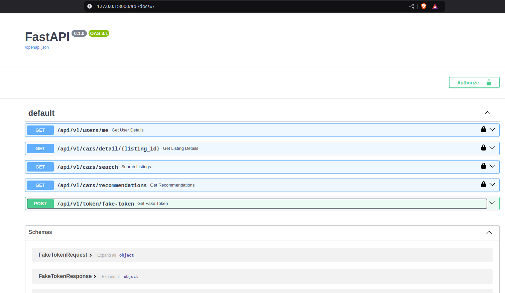
5. obtain fake auth token (use the default user "john1@example.com")
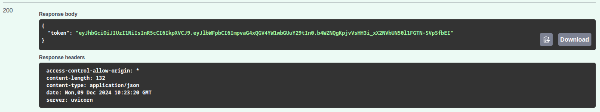
6. copy the token value to the swagger ui authorize form
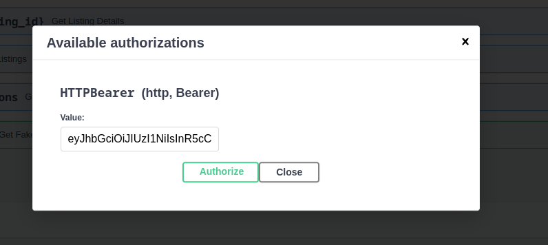
7. get user info
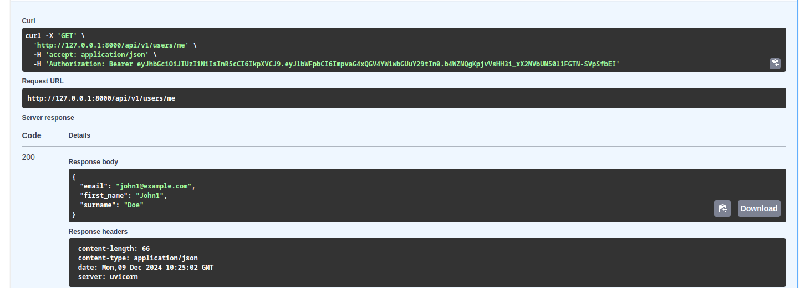
8. search car listings
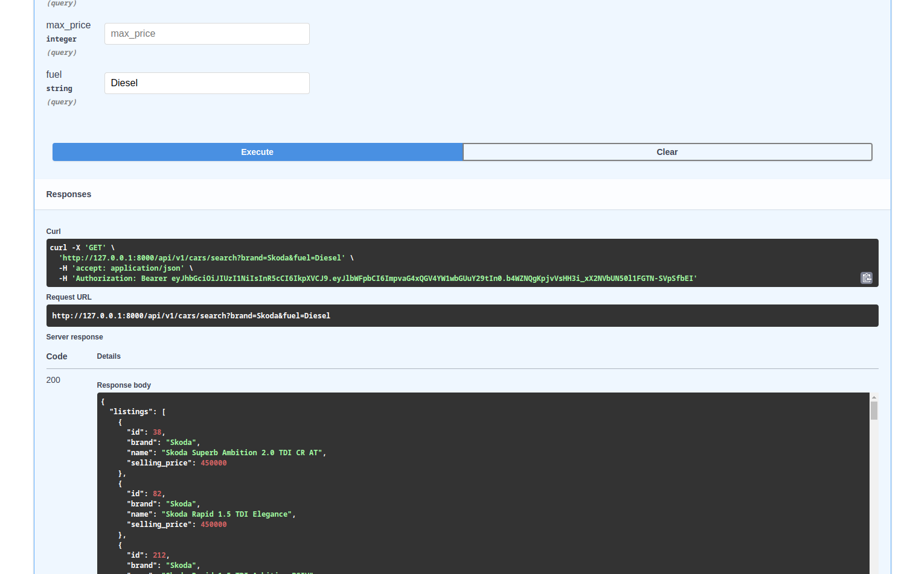
9. get details about a particular listing
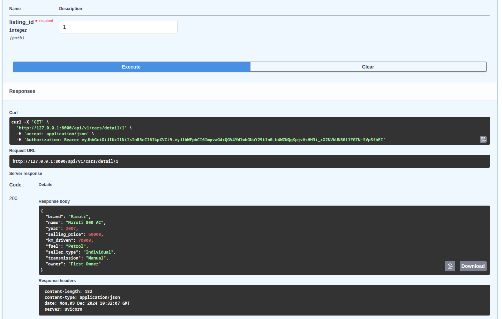
10. get car recommendations for the authenticated user
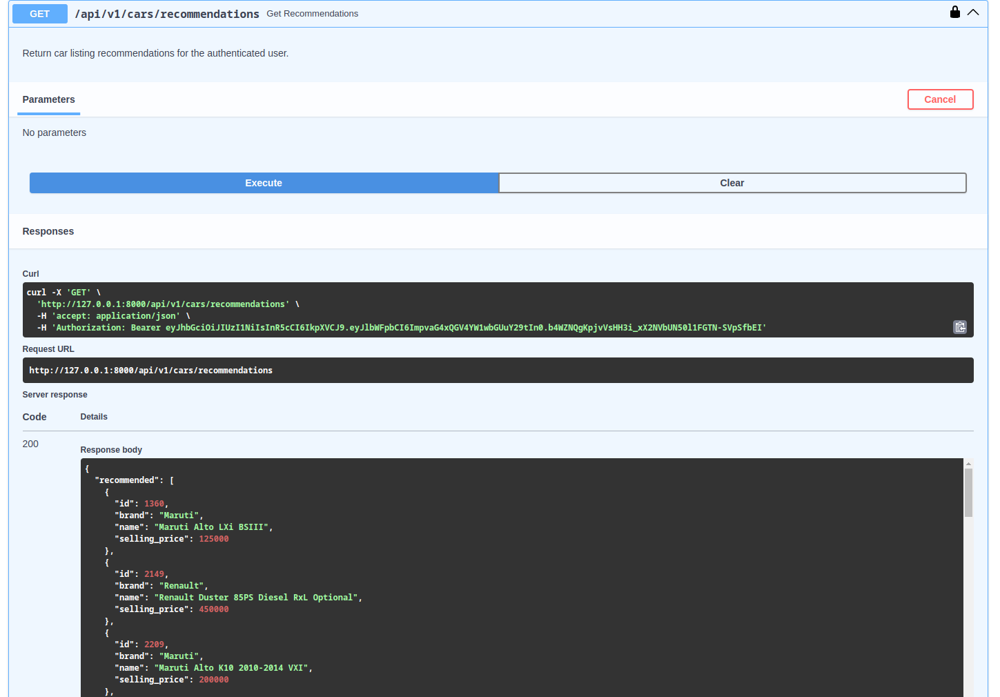

## Development

1. install dev requirements
```bash
pip install -r dev-requirements.txt
```

2. run tests (only one module has test - and that is only because I took that
   code from another project I worked on)
```bash
pytest
```

3. run pre-commit hooks (only whitespaces and ruff are executed)
```bash
pre-commit run --all-files
```
